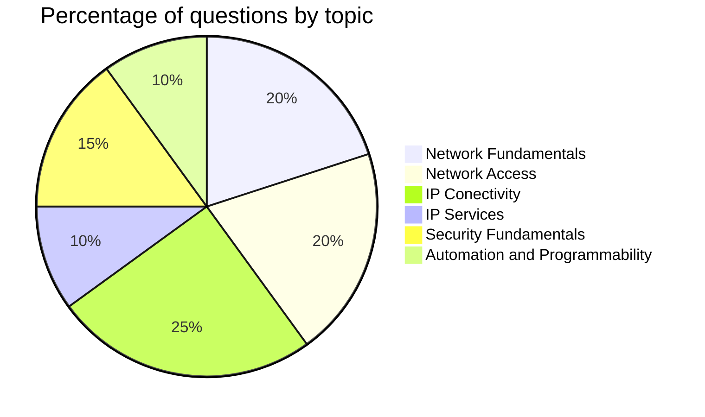

# CCNA-Study
<h2>Guide and commands for exam CISCO CCNA 200-301</h2>

<h3>Oficial Content - CISCO 200-301 CCNA v1.1 Exam Topics</h3>

 1.0 Network Fundamentals           20% 

 

 2.0 Network Access                 20% 

 

 3.0 IP Conectivity                 25% 

 

 4.0 IP Services                    10% 

 

 5.0 Security Fundamentals          15% 

 

 6.0 Automation and Programmability 10% 

 

* https://learningnetwork.cisco.com/s/ccna-exam-topics
* https://learningcontent.cisco.com/documents/marketing/exam-topics/200-301-CCNA-v1.1.pdf

Introduction to Networking

> [!NOTE]
> Protocol Data Unit (PDU) - Cisco Model
> Frame - Layer 2.
> Packet - Layer 3.
> Segment - Layer 4.

* Same Layer Interaction - Communication between devices on the same layer
* Adjacent Layer Interaction - refers to how the adjacent networking layers in the same computer interact to each other. The higher-layer protocol uses the next lower-layer protocol to perform the service it needed; the lower layer provides a service to the layer above it.
