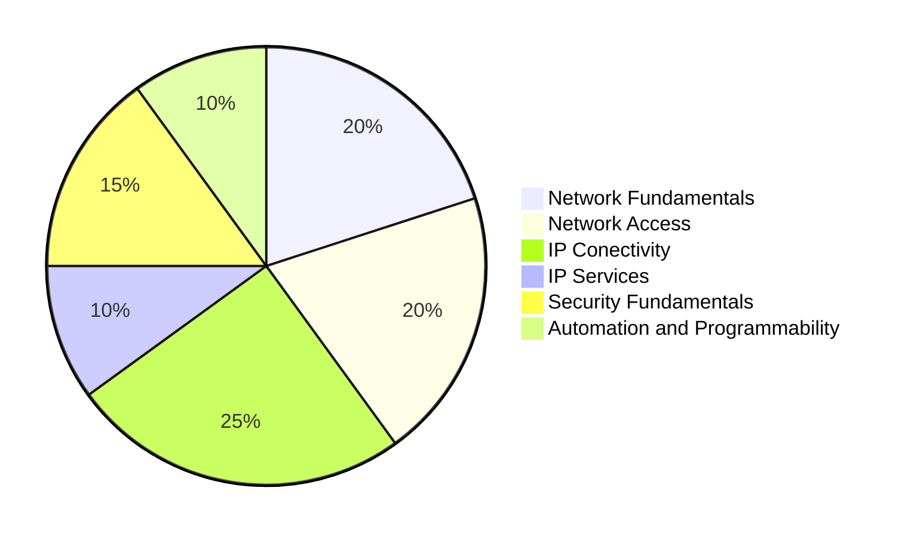

# CCNA-Study
Guide and commands for exam CISCO CCNA 200-301

Oficial Content - CISCO 
200-301 CCNA v1.1 Exam Topics

 1.0 Network Fundamentals           20% 

 

 2.0 Network Access                 20% 

 

 3.0 IP Conectivity                 25% 

 

 4.0 IP Services                    10% 

 

 5.0 Security Fundamentals          15% 

 

 6.0 Automation and Programmability 10% 

 

https://learningnetwork.cisco.com/s/ccna-exam-topics
https://learningcontent.cisco.com/documents/marketing/exam-topics/200-301-CCNA-v1.1.pdf
